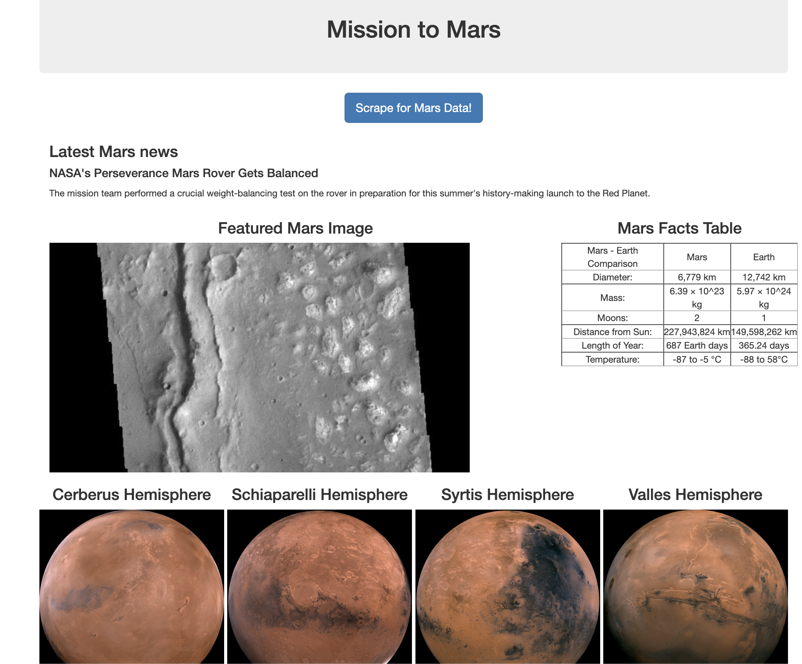

Summary/Problem: This repo contains contents for scraping from multiple web pages that have information on planet Mars. The info scraped is used to populate a simple dashboard/webpage. We are trying to combine data from three websites that all provide different informaiton on the planet mars. The goal is to provide a webpage that acts as a visualization dashboard for the user. The user simply clicks the web scraping button as seen in the image below and the webpage populates after scraing multliple pages. MongoDB is utilized through app.py to create a database and enter data into the database.

***
The repo has the following contents:
1. app.py - This file runs the flask that connects to the index.html with render_template and the scrape_mars.py
2. scrape_mars.py - contains the code for scraping multiple websites
3. mission_to_mars.ipynb - contains the code within scrape_mars.py but within a jupyter notebook as required in part 1 of the assignment.
4. Templates folder
    1. index.html - contains html code to display flask
5. Static Folder/ CSS Folder
    1. style.css - contains styling for index.html
6. index_html_screenshot - screenshot of webpage created after scraping data
